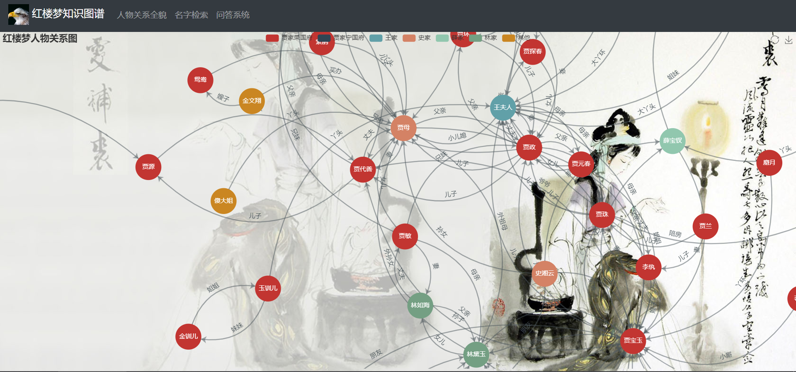

# KGQA-of-HongLouMeng

> inspired by https://github.com/chizhu/KGQA_HLM.


## DESCRIPTION

一个红楼梦知识图谱问答系统平台



## HOW TO USE

### DOCKER

```shell
docker run -it -d -p 7474:7474 -p 7687:7687 -p 5000:5000 stegacrpto/hlmkgqa
#docker exec进入容器，修改相关配置
flask run --host:0.0.0.0
```

### Linux平台（debian为例）

```shell
cd /etc/apt
echo "deb http://mirrors.aliyun.com/debian/ buster main non-free contrib" > sources.list
echo "deb-src http://mirrors.aliyun.com/debian/ buster main non-free contrib" >> sources.list
echo "deb http://mirrors.aliyun.com/debian-security buster/updates main" >> sources.list
echo "deb-src http://mirrors.aliyun.com/debian-security buster/updates main" >> sources.list
echo "deb http://mirrors.aliyun.com/debian/ buster-updates main non-free contrib" >> sources.list
echo "deb-src http://mirrors.aliyun.com/debian/ buster-updates main non-free contrib" >> sources.list
echo "deb http://mirrors.aliyun.com/debian/ buster-backports main non-free contrib" >> sources.list
echo "deb-src http://mirrors.aliyun.com/debian/ buster-backports main non-free contrib" >> sources.list
apt-get update
apt-get install python3.7
apt-get install python3-pip
pip3 install -i https://pypi.tuna.tsinghua.edu.cn/simple flask
pip3 install -i https://pypi.tuna.tsinghua.edu.cn/simple py2neo

#pyltp编译安装过程：（时间比较长）
cd ~
apt-get install git
git clone https://gitee.com/curled/pyltp.git
cd pyltp
git submodule init
git submodule update
# 修改patch/libs/python/src/converter/builtin_converters.cpp内51行，改_PyUnicode_AsString(obj)为(void*)_PyUnicode_AsString(obj)  
python3 setup.py install

#直接用wheel文件安装
pip3 install pyltp-0.2.3-cp37-cp37m-linux_x86_64.whl

#下载模型
cd~
wget http://model.scir.yunfutech.com/model/ltp_data_v3.4.0.zip
apt-get install unzip
unzip ltp_data_v3.4.0.zip

#修改配置，运行项目
git clone https://gitee.com/curled/KGQA-of-HongLouMeng.git
app.py模型路径修改为/root/ltp_data_v3.4.0
cd neo_db
#修改neo4j数据库信息
python3 create_graph.py
cd ..
flask run --host:0.0.0.0
```

### Windows平台

类linux安装过程。

## TODO

- [x] 全人物关系
- [x] 通过姓名查询
- [x] 问答系统
- [ ] 人物节点详细信息